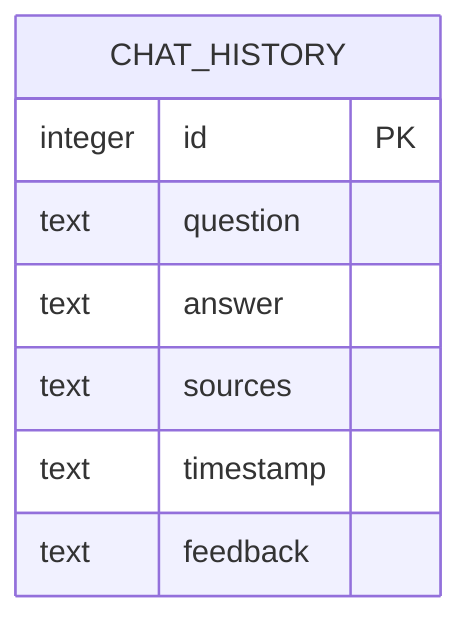

# Database ERD - University FAQ Chatbot

## Table: chat_history

Single-table design used to log every question asked to the chatbot,
the answer generated, the source chunks retrieved, when it happened,
and optional user feedback.

| Column     | Type    | Description                                         |
|------------|---------|------------------------------------------------------|
| id         | INTEGER | Primary key, auto-incremented                        |
| question   | TEXT    | The student's question                               |
| answer     | TEXT    | The chatbot's generated answer                        |
| sources    | TEXT    | The retrieved source chunks used to answer, joined    |
| timestamp  | TEXT    | ISO-format datetime of the interaction                |
| feedback   | TEXT    | User feedback: 'helpful', 'not_helpful', or NULL      |

A single-table design was chosen since the system only needs to log
interactions for evaluation and review purposes, rather than manage
multiple related entities (e.g. separate users, sessions, or documents
tables), which would add unnecessary complexity for this project's scope.
